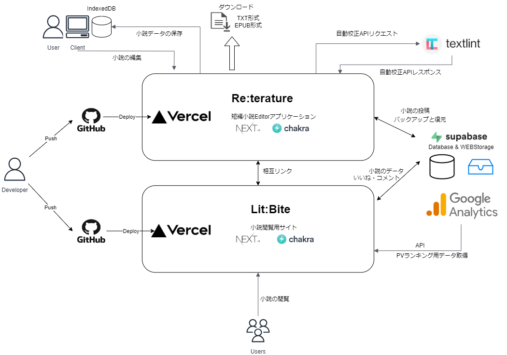

### About Re:terature

- ‟Re:terature” is a simple editor application designed for writing novels!
- Novels are automatically saved in your browser's Indexeddb.
- Backup function saves the current state to the cloud (supabase).
- Automatic proofreading using Textlint is available (Japanese only).
- You can output your novel as an EPUB e-book file.
- You can use it for free, no user registration or login required!
- Recommended browser is Chrome or Brave. You can install it on your desktop and use it like a native application.

### Technology Stacks

- Language: TypeScript
- Framework: Next.js
- Style framework: ChakraUI
- State management：Recoil
- Cloud DB：supabase

See package.json for version

### Architecture

### Link to the actual application and how to use it

**[Re:terature](https://novel-editor-ver2.vercel.app/)**

**[How to use Re:terature](https://www.notion.so/How-to-use-Re-terature-a746fd05c74a42cda7bd15fb2886b580?pvs=4)**

#### Click here to download a sample of the output e-book file.

[Sample e-book file](https://www.dropbox.com/scl/fi/8tamsxet8q42bad6553lk/Smile-for-you.epub?rlkey=wjft7rl7svd3z9uxxlj7moksh&dl=0)

Must be downloaded and viewed with an e-reader that supports EPUB format
